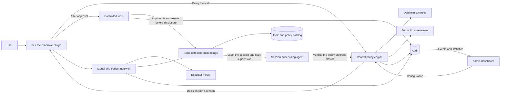

# BLACKWALL

**Before the agent makes its move.**

Central control of AI agent actions: tool permissions, organization policies, risk assessment, budgets and audit in one place.


**HackYeah 2026 · AI Control Layer · Goldman Sachs challenge**

> **Status: concept, demo plan and a working implementation of the demo.** The repo contains the briefs, the solution design, the graphics, a presentation website with an interactive simulation, and — in [`blackwall/`](blackwall/README.md) — working code: a decision server, an OpenAI-compatible model gateway, session topic supervision, a Pi extension, an admin dashboard and tests (unit, live-API and end-to-end with a real Pi agent). The checklist in the "Demo plan" section below is the original plan; what has been built and verified, and how it differs from the concept, is described in [`blackwall/README.md`](blackwall/README.md).

[Running the implementation and the guide](blackwall/docs/demo-guide.md) · [Website and how to run it](website/README.md) · [Concept and architecture](docs/blackwall-koncepcja-i-plan-dema.md) · [Competition brief](docs/golden-sachs.pdf) · [Demo plan](#demo-plan) · [Kindergarten edition](#blackwall-junior)

## What it is about

An agent can read a file, run a program, send data and consume an API budget. Each of these operations needs clearly defined boundaries.

Blackwall is meant to check a proposed action **before it is executed**, according to the central policy of the organization and the user. It combines deterministic rules with semantic assessment. The administrator sees what the agent wanted to do, why it received an approval or a refusal, and whether the operation actually executed.

The first integration will be **Pi**. The target demo consists of a plugin, a control server and an administrator dashboard.

## How it is meant to work

1. The user authenticates the plugin and starts a session.
2. Before every tool call, the plugin asks Blackwall for permission.
3. The server checks identity, policy, arguments, limits and — where the profile requires it — the assessment of the decision model.
4. The plugin receives **allow, deny or require_approval**, with a reason for the model, a decision identifier and an instruction on how the session should continue.
5. An approval lets the specific operation execute. A hard refusal blocks the session, and an error that can be corrected may allow a limited retry. Selected operations wait for one-time confirmation by the user within the limits of the policy.
6. The decision and the result of execution go to the audit. Model calls additionally pass through a gateway that watches the content and the budget.
7. Every supported input/output goes through a sensitive-topic detector. A match labels the session and starts an additional supervisor; a confirmed policy violation closes it as `terminated` before a response is released or an operation is executed.



## What we control

| Area | Capabilities |
| --- | --- |
| **Tools and identity** | User permissions, allowed operations, blocking of a session and of unknown tools. |
| **Files** | Allowed directories and extensions, separate rules for reading and writing, protection of secrets. |
| **Network** | Hosts, IP addresses, ports, HTTP methods and target endpoints. |
| **Content** | Blocking of secrets and redaction of selected data before passing it on. |
| **Semantics** | Assessment of whether an action matches the task, and of instructions coming from untrusted documents. |
| **Sensitive topics** | An embedding-based catalog, session labels, an additional supervisor over all supported traffic, and closure of the session after a policy violation. |
| **Models and resources** | A model allowlist, budget reservations, limits on tokens, time and number of operations. |
| **Audit** | The rule, the policy version, the reason for the decision, the execution result, costs and export of events. |

A hard prohibition cannot be lifted by the assessing model. No response from a required control means no approval. The agent prefers `read`, `write`, `edit`, the controlled `ls`/`find`/`grep`, and HTTP. `bash` remains available for running programs, but every approval requires Jev's assessment. A plain read through `cat` gets a refusal with an instruction to use `read` and a possibility to continue.

The demo uses a prepared environment and synthetic data. Without a sandbox, Jev's assessment does not guarantee limiting all the effects of executed code. Hard isolation of files and network requires a separate executor.

## Demo plan

The working plan assumes **4 people and 24 hours**. The full document contains the division of work, the dependencies, a variant for a smaller team and 32 groups of tests. Adding topic supervision extends the scope and requires re-checking the schedule.

- [ ] The Pi plugin intercepts a tool call and honors continue, wait or session block.
- [ ] The user approves selected operations once; hard prohibitions cannot be bypassed.
- [ ] The backend enforces the global and the user policy.
- [ ] The deterministic rules and a real assessing model work.
- [ ] The model gateway reserves budget before a call and settles usage.
- [ ] Content inspection blocks a secret and shows an example of redaction.
- [ ] The detector labels a session with a sensitive topic, an additional supervisor controls inputs/outputs, and a violation closes the session before a disallowed effect.
- [ ] The dashboard shows events, the reasons for decisions, usage and policy changes.
- [ ] The tests confirm the allowed operations and the absence of effect after a refusal.
- [ ] A safe replay of a historical vulnerability checks the feed rule in a test adapter.

**Three conversations for the presentation:** KYC onboarding with control of the client scope and a one-time write of a draft; analysis of a confidential M&A transaction with a block on a publication suggested by a document; a general HR conversation that starts the supervisor and, after a prohibited evaluation of people, ends with the session being closed. Each story has a diagram in the plan and on the website. These are scenarios of the designed behavior on synthetic data.

The first implementation step is to confirm two things: **a refusal stops the tool before its effect**, and **model calls go through our own gateway**.

**The HR scenario:** a general conversation about the evaluation process starts the `employee_evaluation` label and a supervisor. A later request to evaluate a specific person or to point them out for dismissal closes the session. The model's response is also checked before it is shown to the user, even when the agent uses no tools. A topic alone is not a violation; uncertainty holds the session for an administrator's review.

[The topic supervision design](docs/blackwall-koncepcja-i-plan-dema.md#6a-sensitive-topics-and-the-session-supervising-agent) covers PostgreSQL + pgvector, the catalog and policy versions, the supervisor contract, audit, tests T25–T32 and the latency targets to measure.

## What is in the repo

```text
blackwall/                             # the working implementation (server, gateway, plugin, dashboard, tests)
docs/
├── blackwall-koncepcja-i-plan-dema.md   # requirements, architecture, API, policies and plan
├── blackwall-koncepcja-i-plan-dema-dla-5latka.md # the same plan in simple words
├── golden-sachs.pdf                   # the AI Control Layer brief
├── huawei.pdf                         # the second competition brief
└── assets/
    ├── blackwall-cover.png
    ├── blackwall-cover.prompt.txt
    ├── blackwall-cover-przedszkole.png
    └── blackwall-cover-przedszkole.prompt.txt
website/                               # the presentation website with an interactive simulation
```

The proposed stack in the concept is **TypeScript, Node.js/Fastify, React/Vite and PostgreSQL**, with SSE for dashboard events. The implementation uses TypeScript on Node.js 24 with Fastify, SQLite and a plain-JS dashboard; the differences and their reasons are listed in [`blackwall/README.md`](blackwall/README.md). The example API, YAML and commands in the concept document describe the planned contract.

## Limits of protection

The plugin controls operations that pass through the trusted integration. A user with control over the host can switch it off. An organizational deployment requires a managed execution environment, file and network restrictions, and control of credentials.

An `allow` decision does not prove that an operation executed. A model's `confidence` is not a guarantee of safety. Blackwall is meant to show these differences in the audit and the tests.

## Blackwall Junior

The same firewall, an art budget of two crayons.

[Read the plan in simple words](docs/blackwall-koncepcja-i-plan-dema-dla-5latka.md).

<details>
<summary>Open the kindergarten edition</summary>


</details>

Both covers were created with imagegen. The prompts are stored next to the images: [cyberpunk](docs/assets/blackwall-cover.prompt.txt) and [kindergarten](docs/assets/blackwall-cover-przedszkole.prompt.txt).
