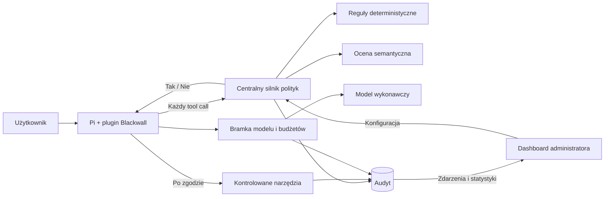

# BLACKWALL

**Zanim agent wykona ruch.**

Centralna kontrola działań agentów AI: uprawnienia do narzędzi, polityki organizacji, ocena ryzyka, budżety i audyt w jednym miejscu.


**HackYeah 2026 · AI Control Layer · wyzwanie Goldman Sachs**

> **Status: koncepcja i plan dema.** W repo są briefy, projekt rozwiązania i materiały graficzne. Plugin, backend i dashboard są zaplanowane; nie ma jeszcze uruchamialnej aplikacji.

[Koncepcja i architektura](docs/blackwall-koncepcja-i-plan-dema.md) · [Brief konkursowy](docs/golden-sachs.pdf) · [Plan dema](#plan-dema) · [Wersja przedszkolna](#blackwall-junior)

## O co chodzi

Agent potrafi przeczytać plik, uruchomić program, wysłać dane i zużyć budżet API. Każda z tych operacji potrzebuje jasno określonych granic.

Blackwall ma sprawdzać proponowane działanie **przed wykonaniem**, zgodnie z centralną polityką organizacji i użytkownika. Łączy reguły deterministyczne z oceną semantyczną. Administrator widzi, co agent chciał zrobić, dlaczego dostał zgodę lub odmowę oraz czy operacja faktycznie się wykonała.

Pierwszą integracją będzie **Pi**. Docelowe demo składa się z pluginu, serwera kontroli i dashboardu administratora.

## Jak ma to działać

1. Użytkownik uwierzytelnia plugin i rozpoczyna sesję.
2. Przed każdym wywołaniem narzędzia plugin pyta Blackwalla o zgodę.
3. Serwer sprawdza tożsamość, politykę, argumenty, limity i — tam, gdzie wymaga tego profil — ocenę modelu decyzyjnego.
4. Plugin otrzymuje **tak albo nie**, z identyfikatorem decyzji w nagłówku odpowiedzi.
5. Zgoda pozwala wykonać konkretną operację. Odmowa blokuje sesję, zatrzymuje pracę agenta i kieruje użytkownika do administratora.
6. Decyzja i wynik wykonania trafiają do audytu. Wywołania modelu przechodzą dodatkowo przez bramkę pilnującą treści i budżetu.



## Co kontrolujemy

| Obszar | Planowane możliwości |
| --- | --- |
| **Narzędzia i tożsamość** | Uprawnienia użytkownika, dozwolone operacje, blokada sesji i nieznanych tooli. |
| **Pliki** | Dozwolone katalogi i rozszerzenia, osobne zasady odczytu i zapisu, ochrona sekretów. |
| **Sieć** | Hosty, adresy IP, porty, metody HTTP i docelowe endpointy. |
| **Treść** | Blokowanie sekretów oraz redakcja wybranych danych przed przekazaniem dalej. |
| **Semantyka** | Ocena zgodności działania z zadaniem i instrukcji pochodzących z niezaufanych dokumentów. |
| **Modele i zasoby** | Allowlista modeli, rezerwacje budżetu, limity tokenów, czasu i liczby operacji. |
| **Audyt** | Reguła, wersja polityki, powód decyzji, wynik wykonania, koszty i eksport zdarzeń. |

Twardego zakazu nie może uchylić model oceniający. Brak odpowiedzi wymaganej kontroli oznacza brak zgody. W MVP dowolny shell jest zablokowany; demo korzysta z kontrolowanych operacji plikowych i HTTP.

## Plan dema

Roboczy plan zakłada **4 osoby i 24 godziny**. Pełny dokument zawiera podział pracy, zależności, wariant dla mniejszego zespołu oraz 18 grup testów.

- [ ] Plugin Pi przechwytuje tool call i zatrzymuje run po odmowie.
- [ ] Backend egzekwuje politykę globalną i użytkownika.
- [ ] Działają reguły deterministyczne i rzeczywisty model oceniający.
- [ ] Bramka modelu rezerwuje budżet przed wywołaniem i rozlicza usage.
- [ ] Kontrola treści blokuje sekret i pokazuje przykład redakcji.
- [ ] Dashboard pokazuje zdarzenia, powody decyzji, zużycie i zmiany polityki.
- [ ] Testy potwierdzają dozwolone operacje oraz brak skutku po odmowie.
- [ ] Bezpieczny replay historycznej podatności sprawdza regułę feedu w adapterze testowym.

**Historia na prezentację:** analityk tworzy raport. Normalny odczyt i zapis przechodzą. Próba dostępu do sekretu zostaje zablokowana. Instrukcja zaszyta w dokumencie wywołuje ocenę semantyczną. Administrator widzi powód, zmienia politykę, a kolejna próba korzysta z nowej wersji. Na koniec pokazujemy limit budżetu i wyniki testów.

Pierwszy krok implementacji to potwierdzenie dwóch rzeczy: **odmowa zatrzymuje tool przed skutkiem**, a **wywołania modelu przechodzą przez własną bramkę**.

## Co jest w repo

```text
docs/
├── blackwall-koncepcja-i-plan-dema.md   # wymagania, architektura, API, polityki i plan
├── golden-sachs.pdf                   # brief AI Control Layer
├── huawei.pdf                         # drugi brief konkursowy
└── assets/
    ├── blackwall-cover.png
    ├── blackwall-cover.prompt.txt
    ├── blackwall-cover-przedszkole.png
    └── blackwall-cover-przedszkole.prompt.txt
```

Proponowany stos to **TypeScript, Node.js/Fastify, React/Vite i PostgreSQL**, z SSE do zdarzeń dashboardu. To wybór projektowy do potwierdzenia przy implementacji. Przykładowe API, YAML i polecenia w dokumencie opisują planowany kontrakt.

## Granice ochrony

Plugin kontroluje operacje przechodzące przez zaufaną integrację. Użytkownik z kontrolą nad hostem może go wyłączyć. Wdrożenie organizacyjne wymaga zarządzanego środowiska wykonawczego, ograniczeń plików i sieci oraz kontroli poświadczeń.

Decyzja `allow` nie dowodzi wykonania operacji. `confidence` modelu nie jest gwarancją bezpieczeństwa. Blackwall ma pokazywać te różnice w audycie i testach.

## Blackwall Junior

Ten sam firewall, budżet artystyczny: dwie kredki.

<details>
<summary>Otwórz edycję przedszkolną</summary>


</details>

Oba covery powstały za pomocą imagegen. Prompty są zapisane obok obrazów: [cyberpunk](docs/assets/blackwall-cover.prompt.txt) i [przedszkole](docs/assets/blackwall-cover-przedszkole.prompt.txt).
