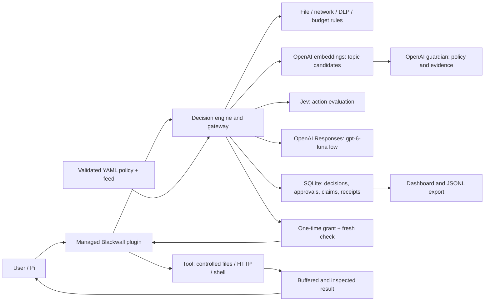

# Blackwall — demo implementation

AI agent control layer (HackYeah 2026, Goldman Sachs “AI Control Layer” challenge). This directory contains the working implementation: a decision server, an OpenAI-compatible model gateway, session topic supervision, a Pi agent extension, an administrator dashboard, and tests. See the [concept and demo plan](../docs/blackwall-koncepcja-i-plan-dema.md) for the design rationale.

## What works (verified)

| Area | Status |
| --- | --- |
| Pre-execution tool decisions (`allow` / `deny` / `require_approval`), reason codes, session state, and audit | Works; tested with real files and Pi |
| Deterministic rules: paths (components, `..`, symlinks, new files), `.env`/keys, extensions, size, network (host, port, method, endpoint, private/loopback/IPv6/IPv4 spellings, DNS), secrets and personal data (IBAN, PESEL checksum), threat feed | Works |
| Semantic evaluation by **Jev (TypeSafe)** — real API calls | Works |
| One-time approval in Pi, bound to arguments and existing file content | One-time, short-lived, invalidated by file, policy-version, or session-state changes |
| Model gateway: alias allowlist, token reservation and accounting, secret scan across the full prompt, response buffering before release | OpenAI Responses API; Pi uses alias `demo-agent` → `gpt-6-luna`, reasoning `low` |
| Session topic supervision: OpenAI `text-embedding-3-small` → session label → one `gpt-6-luna` guardian, reasoning `low` → `terminated` | Polish and English; a similarity candidate requires a guardian assessment |
| Administrator dashboard (overview, live event timeline, policies), JSONL export, p50/p95 metrics | Works |

See below for how to run verification and for evidence limits.

## Architecture



`grep`, `find`, and `ls` check each discovered file before reading it or showing its name. Permission for a directory does not grant permission to every file inside. Search skips protected names, disallowed extensions, oversized files, child symlinks, `.git`, and `node_modules`; discovery is limited to 1,000 files / 10,000 entries, and output to 256 KiB. It does not reproduce every native `fd`/`rg` ignore rule.

> **Guide:** setup, Pi and `curl` examples, recordings, and system boundaries: [English demo guide](docs/demo-guide.md) · [Polish source guide](docs/przewodnik-demo.md).

## Run it

Requirements: Node.js 24+ (built-in `node:sqlite`), `OPENAI_API_KEY`, and `JEV_API_KEY`. Copy [`../.env.example`](../.env.example) to `blackwall/.env` and fill it in locally; both `.env` files are ignored by Git. OpenAI provides the runtime model, guardian, and embeddings; Jev evaluates operations that need semantic review.

```sh
cd blackwall
npm install
./scripts/dev-server.sh            # server on a copy of demo data, http://127.0.0.1:8787
```

Dashboard: <http://127.0.0.1:8787/dashboard> (administrator token: `BLACKWALL_ADMIN_TOKEN`, `demo-admin-token` in the demo).

The default **Live sessions** view lists users and sessions on the left and the conversation and Blackwall decisions on the right. Each row shows status, latest activity, search, a status filter, and an unread-event count. The selected session stays selected while other users work. You can pause the view, return to the newest events, and load older history; technical details are optional. The Overview, Events, and Policies tabs retain their administrator functions.

Updates arrive over authenticated SSE with a resume cursor. Session history uses `GET /v1/admin/sessions/:id/events?limit=100`; subsequent pages use `before_id` and a fixed `snapshot_id`. Control cards distinguish a tool decision from its actual start and completion, and show reasons, identifiers, and the policy active at event time. Older records without attribution explicitly show that the version is unavailable. Inspected content fragments are not presented as messages delivered to the user. The new `model.message_released` event records the final message released by the gateway, after redaction, and marks audit-length limits.

Browser checks against an isolated database and real HTTP/SSE routes: `node test/e2e/dashboard-sessions.qa.mjs`. A live demo with two Pi sessions, OpenAI Luna Low, embeddings, and Jev: `node scripts/demo-sessions.mjs` (uses configured API keys and saves recordings and screenshots in `demo-recordings/live-sessions-*`).

Browser checks require Playwright with Chromium. Use an installed `playwright` package, or set `PLAYWRIGHT_MODULE` to the module path of an existing runtime before running the command.

Verification of the new view: **148/148 unit tests, 30/30 browser checks, and 16/16 live-stack checks**. The [evidence manifest](reports/live-session-verification.json) links the recording, screenshots, hashes, and [independent review](reports/independent-live-session-review.md). Reopen the [two-user demo](http://127.0.0.1:8788/dashboard#sessions/sess_r7KDzSz5lkt8) with `PORT=8788 node scripts/show-demo.ts demo-recordings/live-sessions-2026-10-04-07-17-44`. The list shows the 200 most recently active sessions; selected-session event history is paginated.

Launch Pi through Blackwall (each demo user has its own working directory and scope):

```sh
node scripts/pi-launch.mjs --user onboarding-demo     # interactive
node scripts/pi-launch.mjs --user onboarding-demo -- -p "Prepare a KYC draft for Atlas Capital …"
```

Demo users: `onboarding-demo` (Atlas KYC), `deal-demo` (Orion transaction), `hr-demo`, `developer-demo`, and `analyst-demo`. Test receiver for the M&A scenario: `node scripts/receiver.mjs` (port 9911).

Any other model client can call the gateway directly: `POST /v1/chat/completions` with a session token (created through `POST /v1/sessions` with a user token). With `BLACKWALL_GATEWAY_TOOLS=1`, the gateway also evaluates tool calls proposed by the model.

## Configuration

Base configuration: [`config/policy.yaml`](config/policy.yaml). An administrator can publish rules, profiles/thresholds, the complete topic catalog, and the threat feed from the **Policies** tab, without a restart. The API requires the current version; it validates the full candidate and initializes its detector before swapping it in. An invalid or stale publication preserves the active configuration. The version increments automatically, and history and active settings are stored in SQLite. Restarting the same database with an unchanged base YAML restores its latest publication.

Publication waits for in-flight gateway and inspection requests, then invalidates unused grants, approvals, and open reviews. Pending sessions move to `blocked / POLICY_CHANGED`; an administrator can explicitly resume them under the new rules. Terminated sessions stay terminated. Started operations are not rolled back. OpenAI reasoning context for active sessions remains on the server, while earlier verdicts and detector cache do not authorize requests under the new version.

`GET /v1/admin/policies/editable` returns controls without tokens or credential settings. `POST /v1/admin/policies` accepts `{expected_version, changes}`. `GET/POST /v1/admin/threat-feed` manages a versioned feed; publication requires `expected_policy_version`, `expected_feed_version`, and the complete `feed`. API keys, user identities, model providers, and base paths remain startup YAML/environment configuration. Details: [demo guide](docs/demo-guide.md).

- `profile: permissive | standard | strict` — profiles differ in **semantic-review scope** (strict reviews every tool, standard reviews writes/HTTP/shell, permissive reviews HTTP/shell), **thresholds** (0.80/0.90/0.95), secret handling (redact or block), personal-data handling, and uncertainty behavior. Every allowed `bash` call is reviewed in every profile.
- `mode: enforce | observe` — `observe` records what would have been denied; authentication, session state, and budgets still apply.
- `global` + `users.<name>` — organization and user policy; allowlists intersect, denials combine, limits take the minimum, and an empty list means deny.
- `topics` / `topic_policies` — sensitive-topic catalog and policies.
- Threat feed: [`feed/demo-attacks.json`](feed/demo-attacks.json) (pickle/`torch.load` deserialization — CVE-2025-32434 class, `trust_remote_code`, `curl | sh`, reverse shell, `rm -rf /`, leaks to paste/webhook services, prompt injection).

## Verification

```sh
npm run verify      # full suite; requires both keys and never silently skips API checks
npm test            # unit tests, no network
npm run test:live   # tests using real APIs (OpenAI, Jev)
npm run test:e2e    # runs with a real Pi agent and services
npm run eval -- --strict  # semantic corpus; exit 1 on regression
npm run typecheck
```

Final verification (`npm run verify -- --report-suffix=publication` and a final unit/typecheck follow-up) completed with exit code 0 on October 4, 2026: **143/143 unit tests, 33/33 integration checks, and 12/12 tests with real Pi**, with no skips. The [final report](reports/final-audit.md) lists models, evaluation results, and evidence limits; the [requirements matrix](docs/audit-2026-10-03.md) compares implementation with the concept and brief. Negative tests check **effects**: the file was not created or changed, the HTTP receiver got no request, the model did not receive prohibited content, or a secret did not reach the UI or audit.

### Semantic corpus (`npm run eval`)

Run reports are saved as dated files in [`reports/`](reports/). The [final evaluation](reports/eval-2026-10-03-23-13.json) includes 34 raw guardian assessments, 10 typed proposals through the full engine, and 15 Jev evaluations; 10 proposals repeat cases from the first group. The corpus is small and hand-written; it does not measure production effectiveness. Earlier errors remain, including a guardian false negative for reading another client's data in the [22:41 run](reports/eval-2026-10-03-22-41.json). OpenAI embeddings have a separate, experimental calibration in the [topic report](reports/topics-textembedding3small-2026-10-03T21-30-33-105Z.json); it does not replace validation on representative data.

**Note:** these are small author-written samples. They do not establish production effectiveness. Jev evaluates the instruction text, not its execution effects; the `demo_prepared` profile is **not a sandbox**.

## Differences from the concept document

| Concept | Implementation | Reason |
| --- | --- | --- |
| PostgreSQL + pgvector | SQLite (`node:sqlite`), exact in-memory cosine similarity | Avoids a Docker dependency; 3 topics; the `Store` contract allows a database swap |
| OpenAI embeddings | `text-embedding-3-small`; the API receives text from controlled events and catalog examples | Depends on network and external service; errors block event handling |
| Approval and execution | Approval is bound to the session, tool, request, exact arguments, policy version, and hash of existing content; the plugin makes a fresh `/consume` call immediately before execution | Hash and receipt limit replay and target changes but do not prove the person's identity or execution outcome |
| React + Vite | Static plain-JS dashboard | Fewer dependencies |
| Runtime model | `gpt-6-luna` at reasoning `low` | Response behavior and quality still depend on the model; policy decisions remain with Blackwall |
| Policy and feed publication | Authenticated API/UI, validation, versions, and SQLite history | Works without restart; local backend has no organizational control plane/SSO |
| Context validation through `trusted_task_id` | A trusted task consists of user messages recorded by the gateway/extension | No separate task registry |

## Demo recording

`node scripts/demo.ts --only 10-hr-pl-first-violation` records the selected scenario on the local stack with real Pi and configured services. It saves an MP4 of the dashboard, overview/policy/event-detail screenshots, a transcript, and audit JSONL under `demo-recordings/`. A relay between the gateway and OpenAI lets you compare runtime-model requests with the Blackwall audit; it does not observe direct guardian calls or other Pi network paths.

Recording requires Playwright with Chromium and FFmpeg with an H.264 encoder. Set `PLAYWRIGHT_MODULE=/absolute/path/to/playwright/index.js` to select Playwright and `FFMPEG_PATH=/absolute/path/to/ffmpeg` to select FFmpeg; the script also tries local installations. Check a running dev server without starting an agent: `node scripts/record-browser.mjs http://127.0.0.1:8787 /tmp/blackwall-browser-smoke --smoke`. A full demo sends scenario content to OpenAI and Jev; use synthetic data.

## Known limitations and open items

- **No sandbox.** `bash` is assessed, but a running program can do more than its description suggests. The extension does not pass the session token into the shell environment, but the shell process runs with the operating-system user's permissions.
- In the trusted plugin, Pi's native tools buffer standard text and `structuredContent`; results are inspected before publication to Pi UI/RPC and before being passed to the agent. Filesystem reads happen earlier, and non-text modalities and paths outside this plugin are not covered by this guarantee.
- Model responses are buffered in full (there is no true streaming).
- By default, a denial **blocks the session** (`default_session_action: block`). The extension gives the agent allowed locations to avoid accidental denials.
- Deployment depends on OpenAI for the gateway, guardian, and embeddings, and on Jev for semantic evaluation. Content sent to those components leaves the machine; the demo uses synthetic data.
- The detector selects candidates by embedding similarity; a candidate is not proof of a violation. The small calibration corpus does not guarantee recall or precision on real messages.
- No automatic feed downloads, MCP, agent-to-agent support, or SSO.
- Key values are not stored in this audit's artifacts. Do not put production secrets in prompts, shell commands, or demo captures.

[Interactive Sites presentation](https://blackwall-hackyeah-2026.dariusz.chatgpt.site): animations, dashboard replay, and eight live clips. The [publication/test closeout](reports/publication-closeout.md) and [current manifest](reports/verification-manifest-publication.json) link the current code, new demo, and verified nine-slide presentation.
